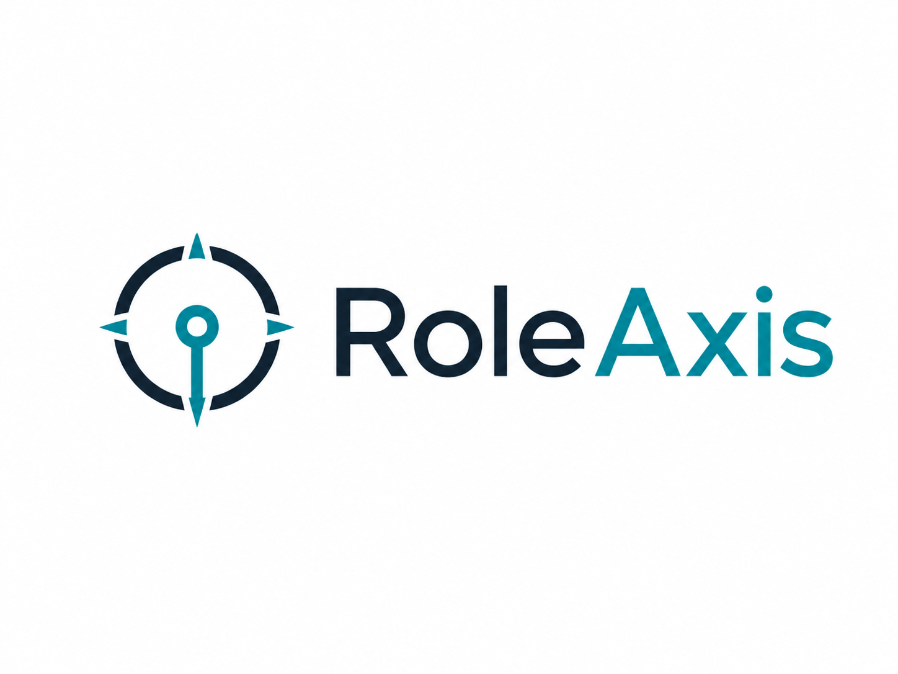

  

# RoleAxis

**Your job search, aligned and automated.**

RoleAxis is a premium job-search automation platform for managing the full path from resume intake to submitted applications and interview preparation. It is built around a simple idea: job searching should feel organized, strategic, and controlled instead of repetitive and overwhelming.

RoleAxis combines a conversational control surface with structured workflow pages so users can define their goals, approve sensitive decisions, and let the system handle the operational work of finding, preparing, submitting, and tracking applications.

## What RoleAxis Does

- Reads a user's resume and turns it into a structured career profile.
- Guides the user through a complete intake covering job goals, salary, location, schedule, work authorization, application preferences, and sensitive answer defaults.
- Searches for roles across configured sources and filters by fit, pay, location, schedule, seniority, and user rules.
- Scores opportunities and explains why each role matches or does not match.
- Tailors resumes, cover letters, and application answers from verified user information.
- Fills applications and creates portal accounts when allowed.
- Stores generated credentials through a secure vault model.
- Submits applications automatically when the user's rules allow it.
- Pauses for approval when questions are sensitive, unsupported, risky, or outside configured automation rules.
- Records every submitted application in an Applied Jobs ledger.
- Moves active opportunities into an Interviews workflow with role-specific prep, practice, notes, and follow-up support.

## Product Standard

RoleAxis is automation-first and conversation-controlled. The product should feel like a real job-search command center, not a generic dashboard.

Every workflow must be usable, traceable, and polished. No placeholder actions, fake integrations, dead buttons, weak visual states, or incomplete pages should be treated as finished work.

Core surfaces include:

- Launch and intake.
- Command center.
- Search console.
- Review queue.
- Applied jobs.
- Job detail dossiers.
- Documents.
- Credential vault.
- Interviews.
- Settings and rules.

## Application Integrity

RoleAxis may optimize presentation, but it must not invent facts.

The system can reorder skills, emphasize relevant experience, mirror job language when accurate, and create role-specific documents from verified user information. It must not fabricate degrees, certifications, employers, job titles, legal status, tools, clearances, dates, or years of experience.

Sensitive application answers require explicit user configuration before reuse. This includes military service, veteran status, disability self-identification, demographic questions, background information, medical or accommodation questions, work authorization, sponsorship, compensation, and final attestations.

## Build Guide

The project standard lives in [BUILD_GUIDE.md](BUILD_GUIDE.md). Read it before making product, code, design, research, automation, or architecture decisions.

That guide defines:

- RoleAxis identity.
- Automation rules.
- Intake requirements.
- Application question research requirements.
- Sensitive answer handling.
- Security and privacy expectations.
- Premium experience standards.
- Visual quality gates.
- Technical boundaries.
- Definition of done.

## Foundation Documents

Phase One foundation documents live in [docs/foundation](docs/foundation):

- [Research Sources](docs/foundation/RESEARCH_SOURCES.md)
- [Application Question Library](docs/foundation/APPLICATION_QUESTION_LIBRARY.md)
- [Intake Schema](docs/foundation/INTAKE_SCHEMA.md)
- [Automation Rules](docs/foundation/AUTOMATION_RULES.md)
- [Product Roadmap](docs/foundation/PRODUCT_ROADMAP.md)
- [UX Architecture](docs/foundation/UX_ARCHITECTURE.md)

## Repository Status

RoleAxis is in its foundation stage. The current repository establishes the product direction, quality bar, build rules, brand assets, and development standards before application implementation begins.
